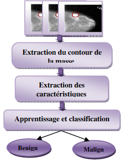

[Retour sommaire](./)

# Application par des équipes de recherche

Cette partie présente trois projets mettant en lumière les applications actuelles de l’apprentissage semi-supervisé par différents centre de recherche, avec des objectifs différents. Les deux premiers articles conceptualisent l’apprentissage semi-supervisé comme un moyen d’obtenir des algorithmes performants avec peu de données labellisées. Le dernier article se penche sur un cas où l’emploi de l’apprentissage semi-supervisé permet d’améliorer les performances d’algorithmes existant. En l’occurrence il s’agit de la génération de paraphrases.

## FixMatch: Simplifying Semi-Supervised Learning with Consistency and Confidence”, Google Research, Janvier 2019 

 
  Dans cet article, les chercheurs de Google Research démontrent la puissance d'une simple combinaison de deux méthodes SSL courantes : le pseudo-étiquetage, et l’autre nommé « consitency regularization ». L’algorithme créé, FixMatchfirst, génère des pseudo-étiquettes en utilisant les prédictions du modèle sur des images non étiquetées « faiblement augmentées ».  L'augmentation faible est une stratégie d'augmentation standard flip-and-shift. Il s’agit ici de faire aléatoirement pivoter les images horizontalement avec une probabilité de 50% sur tous les ensembles de données et translater  aléatoirement les images jusqu'à 12,5% verticalement et horizontalement. 

 
Pour une image donnée, la pseudo-étiquette n'est conservée que si le modèle produit une prédiction de confiance élevée. Le modèle est ensuite entraîné à prédire le pseudo-label lorsqu'on lui présente une version fortement augmentée de la même image. Pour l'augmentation "forte", deux approches basées sur l'auto-augmentation. Il s’agit d’une stratégie  d'augmentation basée sur des transformations de la librairie Python Imaging en utilisant l'apprentissage par  renforcement. Des exemples d’images faiblement augmentées et fortement augmentées sont présentés dans le schéma de fonctionnement explicatif de l’algorithme.

 
Bien que considéré comme simple par les chercheurs de l’article, FixMatch atteint des performances de pointe sur une variété de critères d'apprentissage semi-supervisés standard. Les performances ont été évaluées sur la base de données CIFAR-10. L'ensemble de données CIFAR-10 (Canadian Institute For Advanced Research) est une collection d'images qui sont couramment utilisées pour entraîner les algorithmes d'apprentissage automatique et de vision par ordinateur. C'est l'un des ensembles de données les plus utilisés pour la recherche sur l'apprentissage machine. L'ensemble de données CIFAR-10 contient 60 000 images 32x32 en couleur réparties en 10 classes différentes. Les 10 classes différentes représentent des avions, des voitures, des oiseaux, des chats, des cerfs, des chiens, des grenouilles, des chevaux, des bateaux et des camions. Il y a 6.000 images de chaque classe.

 
Les résultats donnent une précision de 94,93 % sur CIFAR-10 avec 250 étiquettes et une précision de 88,61 % avec 40 - seulement 4 étiquettes par classe. 

  <figure>
    
    <figcaption>
      Tout d'abord, une version faiblement augmentée d'une image non étiquetée (en haut) est introduite dans le modèle pour obtenir ses prédictions (encadré rouge). Lorsque le modèle attribue une probabilité à une classe quelconque qui se situe au-dessus d'un seuil (ligne pointillée), la prédiction est convertie en pseudo-étiquette à un seul point. Ensuite, l’algorithme calcule la "prédiction du modèle pour une version fortement augmentée de la même image" (en bas). Le modèle a été conçu pour que la prédiction de la version fortement augmentée soit comparée à la pseudo-étiquette par une fonction  d'entropie croisée standard. 
    </figcaption>
</figure>
  
## Utilisation de l’approche semi-supervisée pour la détection du cancer du sein, Université d'Annaba, octobre 2014 

 
Cette article de recherche écrit par des membres du département d’informatique d’Annaba, se penche sur l’utilisation d’algorithmes semi-supervisés pour la détection de tumeur mammaire. Le cancer du sein constitue dans le monde la cause de décès par cancer la plus fréquente chez la femme. En Algérie, le cancer du sein représente près de 50 % des cancers gynécologiques chez la femme. C’est donc une thématique de recherche prioritaire en terme de santé publique.

  
Les systèmes de reconnaissance d’images médicales par algorithmes supervisés nécessitent un grand volume de données acquises qui doivent être labellisées d’une manière précise conduisant à un problème de coût et de présence d’experts. Ces dernières limites ont encouragé l’introduction du paradigme de l’apprentissage semi-supervisé comme outil fiable de classification. Ces chercheurs proposent ici un système d’aide au diagnostic (abrégé en CAD pour Computer Assisted Diagnosis) de cette maladie en se basant d’une manière particulière sur l’utilisation de la technique d’apprentissage semi-supervisé utilisant S3VM qui est l’extension semi-supervisée des SVM. Les performances de ces algorithmes sont qualifiées de « très encourageants » par les rédacteurs de l’article. Le schéma suivant donne le principe général de fonctionnement de l’algorithme, commun à beaucoup d’autres problèmes de classification d’images.

## Application d'algorithmes semi-supervisés par Amazon Research pour Alexa

 
Dans la lettre que Jeff Bezos avait adressée en 2017 aux actionnaires d’Amazon, celui-ci faisait une remarque intéressante à propos d’Alexa, l'assistant intelligent à commande vocale d'Amazon : « Au cours des 12 derniers mois, grâce à l'amélioration des composantes d'apprentissage machine d'Alexa et à l'utilisation de techniques d'apprentissage semi-supervisé, nous avons amélioré la compréhension de la langue parlée d'Alexa de plus de 25 % aux États-Unis, au Royaume-Uni... On peut donc en déduire que l’apprentissage semi-supervisé est à la pointe des algorithmes d’apprentissage dans le domaine du traitement du langage naturel.

 
Dans l'article d'Amzon Research « Paraphrase generation for semi-supervised learning  in NLU»  daté de juin 2019, les chercheurs affirment que  l’'apprentissage semi-supervisé est un moyen efficace d'améliorer les performances des systèmes de traitement du langage naturel. Dans ce travail, ils créent un algorithme intitulé Para-SSL, qui propose une méthode permettant de générer des énoncés candidats en utilisant la paraphrase et l'apprentissage semi-supervisé. Afin d'effectuer la génération de paraphrases dans le contexte d'un dialogue, l’algorithme extrait automatiquement des paires de paraphrases pour créer un corpus de paraphrases. À partir de ces données, l’algorithme construisons un système de génération de paraphrases et effectue une génération de une à plusieurs paraphrases, suivie d'une étape de validation pour ne sélectionner que les énoncés de bonne qualité. 

 
La méthode proposée pour l'apprentissage semi-supervisé utilisant la génération de paraphrases ne nécessite pas de prononciation de la part de l'utilisateur et peut être appliquée avant la mise en place d'une nouvelle fonctionnalité dans un système. Les expériences montrent que cette méthode permet d’atteindre jusqu'à 19% de réduction des erreurs sémantiques relatives sans avoir accès aux propos des utilisateurs, et jusqu'à35 % en cas d'utilisation des déclarations en direct .

<h2 id="references">Références</h2>

van Engelen, J.E., Hoos, H.H., A survey on semi-supervised learning. Mach Learn, https://link.springer.com/article/10.1007/s10994-019-05855-6

Wikipedia, Semi-supervised learning, https://en.wikipedia.org/wiki/Semi-supervised_learning

Le Monde Informatique, L'apprentissage semi-supervisé trouve sa place, https://www.lemondeinformatique.fr/les-dossiers/lire-l-apprentissage-semi-supervise-trouve-sa-place-1031.html

