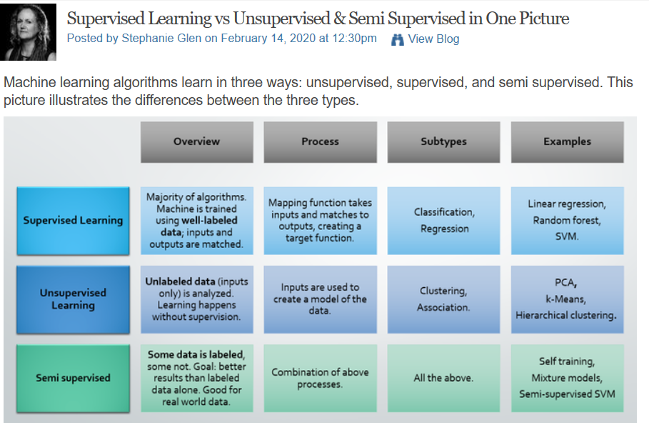
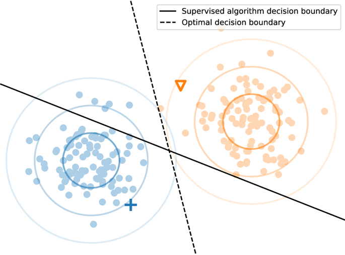
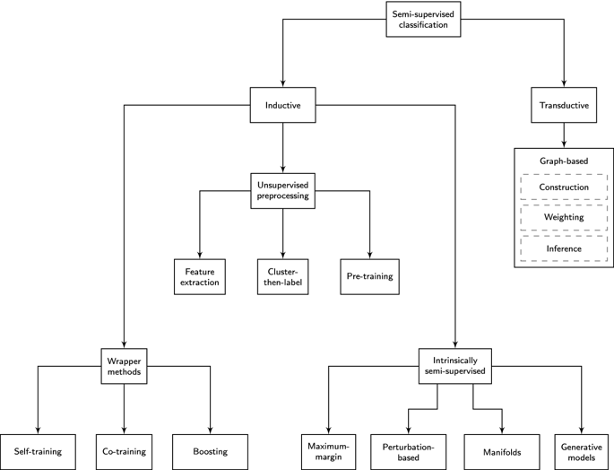

[Retour sommaire](./)

# Principes théoriques de l'apprentissage semi-supervisé

L’objectif de cette partie est de mettre en lumière le fonctionnement théorique de l’apprentissage automatique et la place qu’il occupe dans le monde actuel du machine learning. L'apprentissage semi-supervisé est la branche de l'apprentissage machine qui consiste à utiliser des données étiquetées et non étiquetées pour effectuer certaines tâches d'apprentissage. Conceptuellement situé entre l'apprentissage supervisé et non supervisé, il permet d'exploiter des grandes quantités de données non étiquetées avec des ensembles de données étiquetées généralement plus petits. Ces dernières années, la recherche dans ce domaine a suivi les tendances générales observées dans l'apprentissage machine, avec une grande attention portée aux modèles basés sur les réseaux neuronaux. La littérature sur le sujet a également augmenté en volume et en portée, englobant maintenant un large spectre de théorie, d'algorithmes et d'applications.

## Contexte 

 
On a pu voir dans la partie précédente à quel point l’annotation des données revêt une importance stratégique et économique dans le monde de l’IA. Les algorithmes semi-supervisés sont donc d’un grand intérêt dans l’optique d’annoter le mois de données possibles puisque seul une partie de l’ensemble d’entraînement est annoté. On peut également améliorer significativement un algorithme supervisé déjà existant, simplement en ajoutant des données non étiquetés à l’ensemble d’apprentissage. L'apprentissage semi-supervisé est récemment devenu plus populaire et plus pertinent sur le plan pratique en raison de la variété des problèmes pour lesquels de grandes quantités de données non étiquetées sont disponibles, par exemple du texte sur des sites web, des séquences de protéines ou des images
Ces caractéristiques expliquent certainement la résurgence dans la littérature des techniques d’apprentissage semi-supervisé. L’apprentissage semi-supervisé est ainsi mentionné  parmi les 10 tendances technologiques de 2020 identifiées par le monde informatique.

 
Le tableau suivant propose un comparatif simple des méthodes d’apprentissage supervisés, semi-supervisés, et non supervisés. Cela permet de situer très grossièrement l’apprentissage semi-supervisé parmi les techniques d’apprentissage automatique actuelles.

## Présentation introductive 

 
Dans l'apprentissage machine, on distingue traditionnellement deux grandes tâches : l'apprentissage supervisé et l'apprentissage non supervisé. Dans l'apprentissage supervisé, on présente un ensemble de points de données composé d'une entrée x et d'une valeur de sortie correspondante y. L'objectif est alors de construire un classifieur ou un modèle de régression qui peut estimer la valeur de sortie pour des entrées autres que celles de la phase d’apprentissage. En revanche, dans l'apprentissage non supervisé, aucune valeur de sortie spécifique n'est fournie. Au lieu de cela, on essaie de déduire une structure sous-jacente à partir des entrées. Par exemple, dans le clustering non supervisé, l'objectif est de déduire une correspondance entre les entrées données (par exemple, des vecteurs de nombres réels) et des groupes de telle sorte que des entrées similaires soient mises en correspondance avec le même groupe. L'apprentissage semi-supervisé est une branche de l'apprentissage machine qui vise à combiner ces deux tâches. Généralement, les algorithmes d'apprentissage semi-supervisé tentent d'améliorer les performances dans l'une de ces deux tâches en utilisant des informations généralement associées à l'autre. Par exemple, lors de la résolution d'un problème de classification, des points de données supplémentaires pour lesquels l'étiquette est inconnue peuvent être utilisés pour faciliter le processus de classification. Pour les méthodes de clustering, en revanche, la procédure d'apprentissage peut bénéficier de la connaissance de l'appartenance de certains points de données à la même classe.

  
Comme c'est le cas pour l'apprentissage machine en général, une grande majorité des recherches sur l'apprentissage semi-supervisé se concentre sur la classification. Les méthodes de classification semi-supervisée sont particulièrement pertinentes pour les scénarios où les données étiquetées sont rares. Dans ces cas, il peut être difficile de construire un classificateur supervisé fiable. Cette situation se produit dans des domaines d'application où les données étiquetées sont coûteuses ou difficiles à obtenir, comme le diagnostic assisté par ordinateur, la découverte de médicaments et le marquage de parties de discours. Si l'on dispose de suffisamment de données non étiquetées et sous certaines hypothèses concernant la distribution des données, les données non étiquetées peuvent aider à la construction d'un meilleur classifieur. 

## Fondements théoriques

 
Dans les problèmes d'apprentissage supervisé traditionnels, on nous présente un ensemble ordonné de l points de données étiquetés.  
<math> 
  <mrow> 
    <mi>DL</mi> 
    <mo>=</mo> 
    <msub> 
      <mrow>
        <mi>((xi,yi))</mi> 
        <msub>
          <mi>l</mi>
          <ms>i</ms>
        </msub>
        <mo>=</mo>
        <mi>1...l</mi>
      </ms> 
    </msub>
  </mrow> 
 </math>
Chaque point de données (
<math>
  <mrow>
  <msub>
    <mi>x</mi>
    <ms>i</ms>
  </msub>
  </mrow>
</math>
,
<math>
  <mrow>
  <msub>
    <mi>y</mi>
    <ms>i</ms> 
  </msub>  
  </mrow> 
</math>
) est constitué d'un objet xi∈X provenant d'un espace d'entrée X donné, et a une étiquette associée yi, où yi est un réel dans les problèmes de régression et une classe dans les problèmes de classification. Sur la base d'un ensemble de ces points de données, généralement appelés données d’apprentissage, les méthodes d'apprentissage supervisé tentent de déduire une fonction qui peut déterminer avec succès l'étiquette y d'une entrée inédite x .

 
Cependant, dans de nombreux problèmes de classification du monde réel, nous avons également accès à une collection de points de données u, <math> DU=((x<msup>i</msup>,y<msub>i</msub>))<msub>li=1…u</msub> </math>, dont les étiquettes sont inconnues. Par exemple, les points de données pour lesquels nous voulons faire des prédictions, généralement appelés données de test, ne sont pas étiquetés par définition. Les méthodes de classification semi-supervisées tentent d'utiliser des points de données non étiquetés pour construire un algorithme d’apprentissage dont la performance dépasse celle des algorithmes supervisés obtenus en utilisant uniquement les données étiquetées. Dans la suite de cette partie, nous appellerons XL et XU les entrées pour les échantillons respectivement étiquetés et non étiquetés.

 
Il existe de nombreux cas où des données non étiquetées peuvent aider à construire un classifieur. Prenons, par exemple, le problème de la classification des documents, où l'on souhaite attribuer des sujets à une collection de documents textuels (des articles de presse). En supposant que nos documents soient représentés par l'ensemble des mots qui y figurent, on pourrait former un simple classifieur supervisé qui, par exemple, apprendrait à reconnaître que les documents contenant le mot "neutron" concernent généralement la physique. Ce classifieur pourrait bien fonctionner sur des documents contenant des termes qu'il a vus dans les données d'entraînement, mais il échouera lorsqu'un document ne contient pas de mots qui apparaissent dans l'ensemble d'entraînement. Par exemple, si nous rencontrons un document de physique sur les accélérateurs de particules qui ne contient pas le mot "neutron", le classifieur est incapable de le reconnaître comme un document concernant la physique. C'est là qu'intervient l'apprentissage semi-supervisé. Si nous considérons les données non étiquetées, il peut y avoir des documents qui relient le mot "neutron" à l'expression "accélérateur de particules". Par exemple, le mot "neutron" apparaît souvent dans un document qui contient également le mot "quark". En outre, le mot "quark" apparaît régulièrement avec l'expression "accélérateur de particules", ce qui guide les classifieurs dans la classification de ces documents comme étant également liés à la physique, bien qu'ils n'aient jamais vu l'expression "accélérateur de particules" dans les données étiquetées.

 
La figure ci-dessous fournit une autre intuition quant à l'utilisation de données non étiquetées pour la classification. Nous considérons un problème de classification artificielle avec deux classes. Pour les deux classes, 100 échantillons sont tirés d'une distribution gaussienne bidimensionnelle avec des matrices de covariance identiques. L'ensemble de données étiquetées est ensuite construit en prélevant un échantillon de chaque classe. Tout algorithme d'apprentissage supervisé obtiendra très probablement comme limite de décision la ligne continue, qui est perpendiculaire au segment de ligne reliant les deux points de données étiquetés et qui la coupe au milieu. Cependant, ceci est assez loin de la limite de décision optimale. Comme le montre clairement cette figure, les clusters que nous pouvons déduire des données non étiquetées peuvent nous aider considérablement à placer la limite de décision : en supposant que les données proviennent de deux distributions gaussiennes, un simple algorithme d'apprentissage semi-supervisé peut déduire une limite de décision proche de l'optimum.

<figure>
  
  <figcaption>
    Un exemple de base de classification binaire en présence de données non étiquetées. Les points de données non       étiquetés sont colorés en fonction de leur véritable étiquette. Les cercles colorés et non remplis représentent les courbes de niveau de la distribution des données d'entrée correspondant aux écarts types de 1, 2 et 3.
  </figcaption>
</figure>

## Dans quel cadre l'apprentissage semi-supervisé fonctionne-t-il ?

 
L'objectif premier de l'apprentissage semi-supervisé est d'exploiter des données non étiquetées pour la construction de meilleures procédures d'apprentissage. Il s'avère que ce n'est pas toujours facile, ni même possible. Comme mentionné précédemment, les données non étiquetées ne sont utiles que si elles contiennent des informations utiles pour la prédiction de l'étiquette qui ne sont pas contenues dans les seules données étiquetées ou qui ne peuvent pas en être extraites facilement. Pour appliquer en pratique une méthode d'apprentissage semi-supervisée, l'algorithme doit alors être capable d'extraire ces informations. Pour les ingénieurs et les chercheurs, cela soulève la question suivante : quand est-ce le cas ?

 
Malheureusement, il s'est avéré difficile de trouver une réponse pratique à cette question. Non seulement il est difficile de définir avec précision les conditions dans lesquelles un algorithme d'apprentissage semi-supervisé particulier peut fonctionner, mais il est aussi rarement simple d'évaluer dans quelle mesure ces conditions sont remplies. Comme c'est le cas pour les algorithmes d'apprentissage supervisé, aucune méthode n'a encore été découverte pour déterminer a priori quelle méthode d'apprentissage est la mieux adaptée à un problème particulier. De plus, il est impossible de garantir que l'introduction de données non étiquetées ne dégradera pas les performances. Une telle dégradation est particulièrement pertinente dans les scénarios où de bonnes performances peuvent être obtenues avec des classifieurs purement supervisés. Dans ces cas, la dégradation potentielle de la performance est beaucoup plus importante que le gain potentiel.

Le principal enseignement tiré de ces observations est que l'apprentissage semi-supervisé ne doit pas être considéré comme un moyen garanti d'améliorer les performances de prévision par la simple introduction de données non étiquetées. Il devrait plutôt être considéré comme une autre direction dans le processus de recherche et de configuration d'un algorithme d'apprentissage pour la tâche à accomplir. Les procédures d'apprentissage semi-supervisées devraient faire partie de la série d'algorithmes dont l'utilisation est envisagée dans un scénario d'application particulier, et une combinaison d'analyse théorique  et d'évaluation empirique devrait être utilisée pour choisir une approche bien adaptée à la situation donnée.

  

## Présentation des différentes méthodes algorithmiques pour l’apprentissage semi-supervisé

 
Au cours des deux dernières décennies, une grande variété d'algorithmes de classification semi-supervisée a été créée. Ces méthodes diffèrent par les hypothèses d'apprentissage semi-supervisées sur lesquelles elles se fondent, par la manière dont elles utilisent les données non étiquetées et par la façon dont elles se rapportent aux algorithmes supervisés. 

  

  <figure>
  
  <figcaption>
   Visualisation arborescente des méthodes de classification semi-supervisée.
  </figcaption>
</figure>

Chaque feuille de l‘arbre correspond à un type d'approche spécifique pour intégrer des données non étiquetées dans les méthodes de classification. Dans la feuille correspondant aux méthodes transductives, ( méthodes à bases de graphes), les cases en pointillés représentent des phases distinctes du processus de classification, dont chacune présente une multitude de variations.

Au niveau le plus élevé, elle distingue les méthodes inductives et transductives, qui donnent lieu à des procédures d'optimisation distinctes : les premières tentent de trouver un modèle de classification, tandis que les secondes s'attachent uniquement à obtenir des prédictions étiquetées pour les points de données non étiquetés donnés. Au second niveau, l’arbre distingue les méthodes d'apprentissage semi-supervisées selon la manière lesquelles elles intègrent les données non étiquetées. Cette distinction donne naissance à trois classes distinctes de méthodes inductives, chacune d'entre elles étant liée aux classifieurs supervisés de manière différente.

### Méthodes inductives

Les méthodes inductives visent à construire un classifieur qui peut générer des prédictions pour n'importe quel objet dans l'espace d'entrée. Des données non étiquetées peuvent être utilisées lors de la phase d’apprentissage de ce classifieur, mais les prédictions pour de multiples nouveaux exemples, inédits, sont indépendantes les unes des autres une fois l’apprentissage terminé. Cela correspond à l'objectif des méthodes d'apprentissage supervisé : un modèle est construit pendant la phase d’apprentissage et peut ensuite être utilisé pour prédire les étiquettes de nouvelles données.

#### Méthodes de type “wrapper”

Une approche simple pour étendre les algorithmes supervisés existants au cadre semi-supervisé consiste à entraîner d'abord les classifieurs sur les données étiquetées, puis à utiliser les prédictions des classifieurs résultants pour générer des données étiquetées supplémentaires. Les classifieurs peuvent ensuite être entraîné à nouveau sur ces données pseudo-étiquetées en plus des données étiquetées existantes. Ces méthodes sont connues sous le nom de méthodes « wrapper » : les données non étiquetées sont pseudo-étiquetées, et un algorithme d'apprentissage purement supervisé, ignorant la distinction entre les données étiquetées à l'origine et les données pseudo-étiquetées, construit le classifieur inductif final. Une propriété clé des méthodes « wrapper» est que  la plupart d'entre elles peuvent être appliquées à n'importe quel algorithme d’apprentissage supervisé, permettant aux données non étiquetées d'être introduites de manière simple. 

#### Prétraitement non supervisé

Les méthodes de prétraitement non supervisées consistent à, soit extraire des caractéristiques utiles des données non étiquetées, soit préclasser les données, soit déterminer les paramètres initiaux d'une procédure d'apprentissage supervisée de manière non supervisée. Comme les méthodes wrapper, elles peuvent être utilisées avec n'importe quel classifieur supervisé. Cependant, contrairement aux méthodes wrapper, le classifieur supervisé n'est entraîné qu'avec des données étiquetées à l'origine. 

#### Méthodes intrinsèquement semi-supervisées

La dernière classe de méthodes inductives que nous considérons intègre directement des données non étiquetées dans la fonction d'optimisation de la méthode d'apprentissage. Beaucoup de ces méthodes sont des extensions directes des méthodes d'apprentissage supervisées au cadre semi-supervisé : elles étendent la fonction d’erreur du classifieur supervisé pour inclure des données non étiquetées. Les machines à vecteurs de support semi-supervisées (S3VM), par exemple, étendent les SVM supervisés en maximisant la marge non seulement sur les données étiquetées, mais aussi sur les données non étiquetées. Il existe des extensions intrinsèquement semi-supervisées de nombreuses approches d'apprentissage supervisé importantes, y compris SVM les processus gaussiens et les réseaux de neurones.

### Méthodes  transductives

Contrairement aux méthodes inductives, les méthodes transductives ne construisent pas un classifieur pour l'ensemble de l'espace d'entrée. Au contraire, leur pouvoir prédictif est limité aux objets qu'elles rencontrent exactement pendant la phase d'entraînement. Par conséquent, les méthodes transductives n'ont pas de phases d'entraînement et de test distinctes. Comme les méthodes d'apprentissage supervisé ne sont par définition pas fournies avec des données non étiquetées avant la phase de test, il n'existe pas d'analogie claire entre les algorithmes transductifs et l'apprentissage supervisé.

Comme il n'existe pas de modèle de l'espace d'entrée chez les algorithmes d’apprentissage transductif, l'information doit être propagée par des connexions directes entre les points de données. Cette observation donne naturellement naissance à une approche basée sur un graphe pour les méthodes transductives : si un graphe peut être défini dans lequel des données similaires sont connectés, l'information peut alors être propagée le long des bords de ce graphe.

Les méthodes transductives à base de graphes comportent généralement trois étapes : la construction du graphe, la pondération du graphe et l'inférence. Dans la première étape, l'ensemble des objets, X, est utilisé pour construire un graphe où chaque nœud représente un point de données et où des points de données similaires par paires sont reliés par un bord. Dans la deuxième étape, ces arêtes sont pondérées pour représenter l'étendue de la similarité par paire entre les points de données respectifs. Dans la troisième étape, le graphe est utilisé pour attribuer des étiquettes aux points de données non étiquetés.

## Proximité avec le mode d'apprentissage humain 

La façon dont apprend l’homme peut être considérée comme des cas d'apprentissage semi-supervisé. Une grande partie de l'apprentissage des concepts humains implique une petite quantité d'instruction directe (par exemple, l'étiquetage des objets par les parents pendant l'enfance) combinée à une grande quantité d'expérience non étiquetée (par exemple, l'observation des objets sans les nommer ou les compter, ou du moins sans retour d'information).

Les nourrissons humains sont sensibles à la structure des catégories naturelles non étiquetées telles que les images de chiens et de chats ou les visages masculins et féminins. Les nourrissons et les enfants prennent en compte non seulement les exemples non étiquetés, mais aussi le processus d'échantillonnage dont découlent les exemples étiquetés

On a donc vu en quoi l'apprentissage semi-supervisé s'impose comme une méthode algorithmique essentielle, notamment en vue de limiter la quantité de données à étiqueter. Les bases théoriques que l'on a pu poser au cours de cette section vont nous permettre de comprendre certaines applications actuelles dans des secteurs de pointe.

 
→ <a href="./application.html"> Application par des équipes de recherche </a>

<h2 id="references">Références</h2>

van Engelen, J.E., Hoos, H.H., A survey on semi-supervised learning. Mach Learn, https://link.springer.com/article/10.1007/s10994-019-05855-6

Wikipedia, Semi-supervised learning, https://en.wikipedia.org/wiki/Semi-supervised_learning

Le Monde Informatique, L'apprentissage semi-supervisé trouve sa place, https://www.lemondeinformatique.fr/les-dossiers/lire-l-apprentissage-semi-supervise-trouve-sa-place-1031.html

